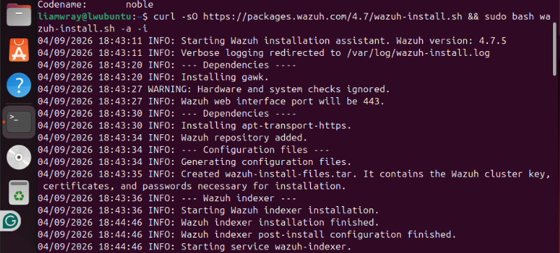
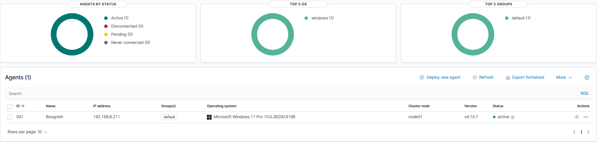

# Day 1 — Wazuh Install & Ubuntu VM Setup
**Date:** September 5, 2026
**Environment:** Proxmox VE | Ubuntu Server 24.04 VM

---

## Goals
- Install Wazuh on Ubuntu VM hosted on Proxmox
- Access Wazuh dashboard in browser
- Confirm stack is healthy and ready for agent enrollment

---

## Journal
First day focused on getting Wazuh running on the Ubuntu VM. Used the official one-line Wazuh install script which installs the full stack which included manager, indexer, and dashboard — automatically.

Ubuntu 24.04 is not officially supported by Wazuh 4.7 so the install script threw a version check error. Fixed by passing the `-i` flag to ignore the check. Install completed successfully despite the warning.

After the install the dashboard wasn't loading in the browser. Diagnosed the issue as a certificate filename mismatch — the config file referenced `dashboard-key.pem` and `dashboard.pem` but the actual cert files were named `wazuh-dashboard-key.pem` and `wazuh-dashboard.pem`. I fixed by updating the config with sed commands to match the actual filenames. Dashboard finally loaded after restarting the service.

---

## Commands Used

**Install Wazuh (with version check bypass):**
```bash
curl -sO https://packages.wazuh.com/4.7/wazuh-install.sh && sudo bash wazuh-install.sh -a -i
```

**Get admin password:**
```bash
sudo tar -O -xvf wazuh-install-files.tar wazuh-install-files/wazuh-passwords.txt
```

**Fix certificate filenames:**
```bash
sudo sed -i 's|/etc/wazuh-dashboard/certs/dashboard-key.pem|/etc/wazuh-dashboard/certs/wazuh-dashboard-key.pem|g' /etc/wazuh-dashboard/opensearch_dashboards.yml

sudo sed -i 's|/etc/wazuh-dashboard/certs/dashboard.pem|/etc/wazuh-dashboard/certs/wazuh-dashboard.pem|g' /etc/wazuh-dashboard/opensearch_dashboards.yml
```

**Restart dashboard:**
```bash
sudo systemctl restart wazuh-dashboard
```

---

## Issues Encountered

| Issue | Fix |
|---|---|
| Ubuntu 24.04 not supported — version check error | Added `-i` flag to bypass check |
| Dashboard not loading in browser | Certificate filenames in config didn't match actual files — fixed with sed |
| Dashboard URL — http vs https | Must use `https://` not `http://` — accept SSL cert warning in browser |


## Screenshots


### Wazuh install cmd



### Wazuh agent installed + dashboard


## Key Takeaways
- Wazuh 4.7 installs fine on Ubuntu 24.04 despite the warning — `-i` flag handles it
- Certificate filename mismatches are a common post-install issue — always verify filenames match config
- Dashboard runs on port 443 via HTTPS — browser will show SSL warning on first load, click proceed
