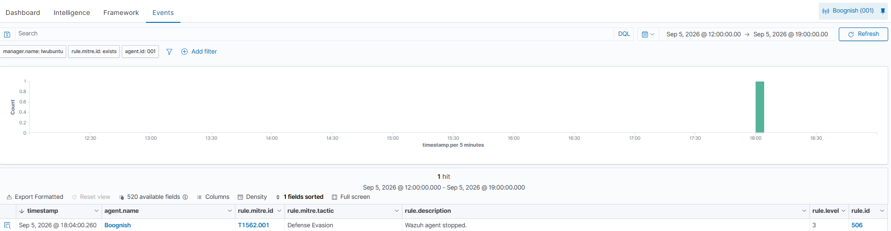

# Day 2 — Windows Agent Enrollment & First MITRE Detection
**Date:** September 6, 2026
**Environment:** Proxmox VE | Ubuntu Server 24.04 VM | Windows 11 Laptop

---

## Goals
- Enroll Windows 11 laptop as a Wazuh agent
- Confirm logs flowing into Wazuh dashboard
- Identify first real security detections

---

## Journal
Day 2 focused on connecting the Windows laptop as a real endpoint. Used the Wazuh dashboard's Deploy New Agent wizard to generate the MSI install command. The initial silent install via PowerShell didn't register the service properly—fixed by downloading the MSI manually via the browser and running it through the Wazuh Agent GUI instead.

After setting the manager IP and starting the agent through the GUI, the agent appeared in the Wazuh dashboard as active within 2 minutes under the name Boognish.

Within minutes of connecting, Wazuh automatically detected and mapped a real event to MITRE ATT&CK with zero configuration — T1562.001 Defense Evasion, triggered by the Wazuh agent being stopped during troubleshooting. Stopping security tools is a known attacker technique, and Wazuh correctly flagged it.

---

## Agent Details

| Field | Value |
|---|---|
| Agent Name | Boognish |
| Agent ID | 001 |
| IP Address | 192.168.8.211 |
| OS | Windows 11 Pro 10.0.26200 |
| Wazuh Version | v4.14.7 |
| Status | Active |

---

## First Detection

| Field | Value |
|---|---|
| MITRE Technique | T1562.001 |
| Tactic | Defense Evasion |
| Sub-technique | Impair Defenses: Disable or Modify Tools |
| Rule | Wazuh agent stopped |
| Rule ID | 506 |
| Rule Level | 3 |
| Timestamp | 2026-09-05 18:04:00 |

**What happened:** When the Wazuh agent service was stopped during troubleshooting, Wazuh flagged it as a potential Defense Evasion attempt. This is correct behavior — stopping security tooling is a real attacker technique used to blind defenders before executing malicious actions.

---

## Issues Encountered

| Issue | Fix |
|---|---|
| PowerShell silent MSI install didn't register service | Downloaded MSI manually via browser, installed through Wazuh Agent GUI |
| Service not found via `NET START WazuhSvc` | Used Wazuh Agent GUI → Manage → Start instead |

---

## Screenshots

- Wazuh MITRE ATT&CK Events tab showing T1562.001 (Defense Evasion) 
- "Wazuh agent stopped" — firing on Sep 5 at 18:04, rule level 3, rule ID 506.
---

## Key Takeaways
- Real endpoints generate real detections immediately — no configuration needed for basic MITRE ATT&CK mapping
- Wazuh monitors its own agent health and maps operational events to ATT&CK techniques
- The GUI installer is more reliable than silent MSI install for the Wazuh Windows agent
