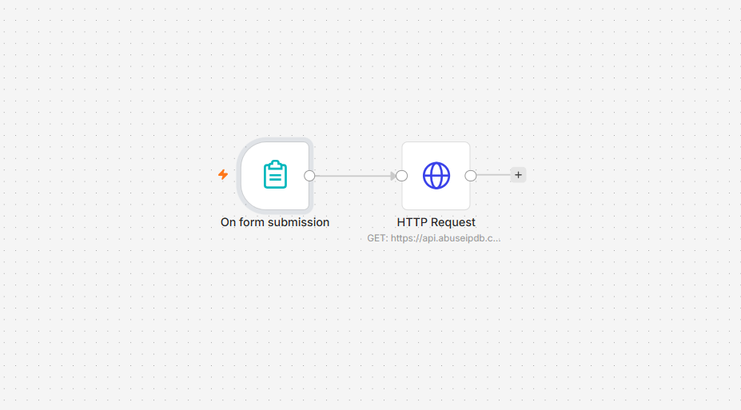
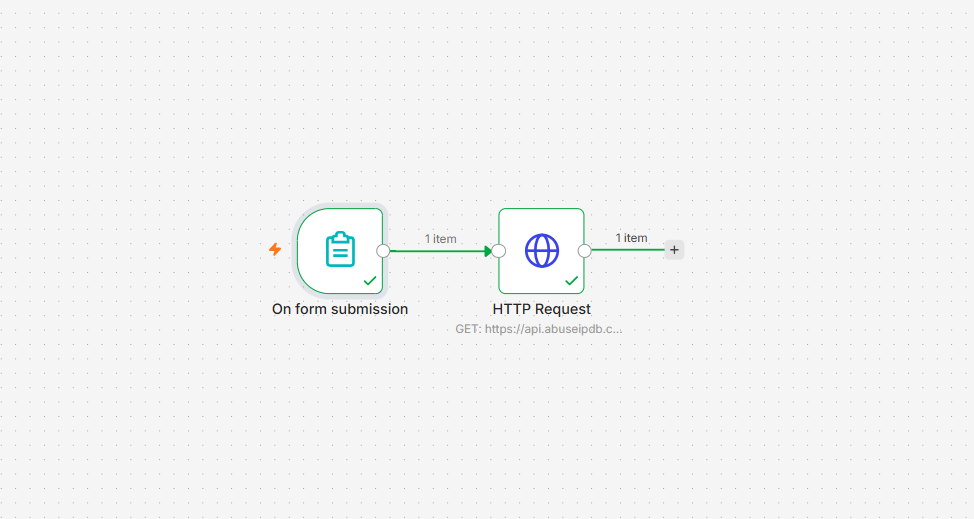
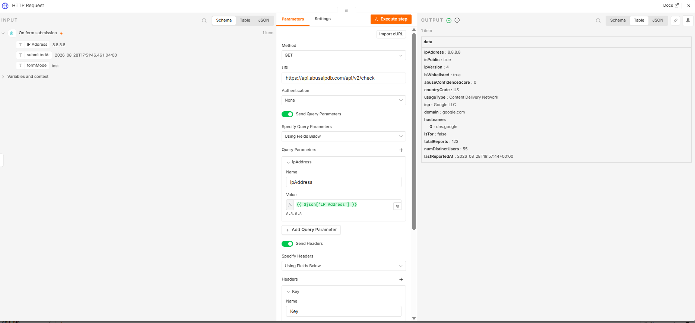
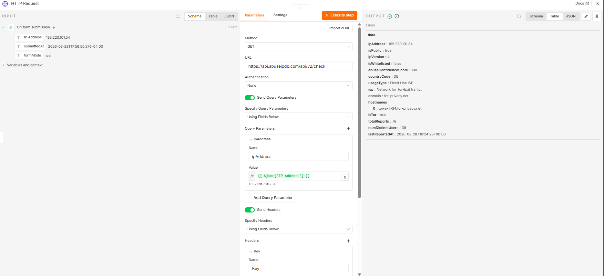
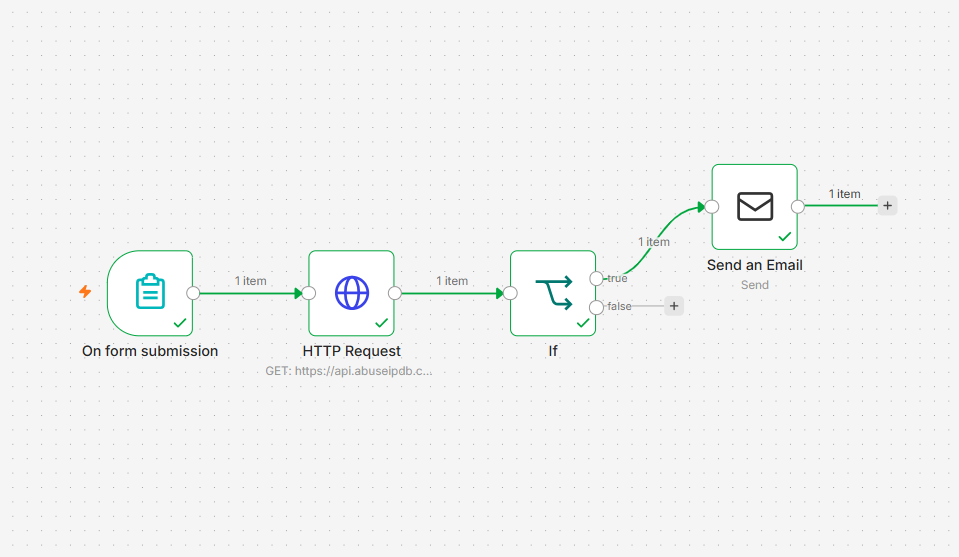
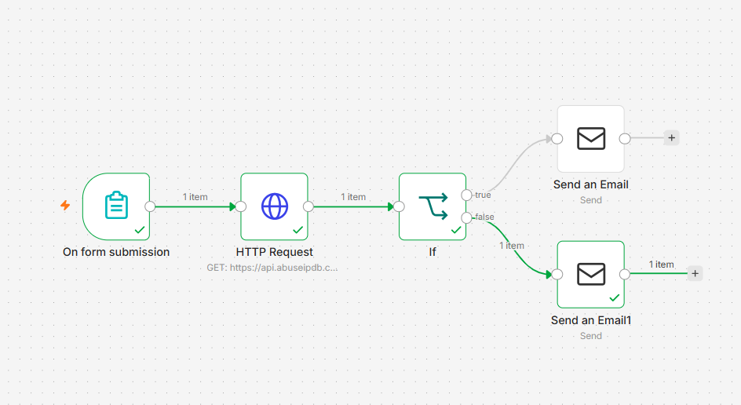
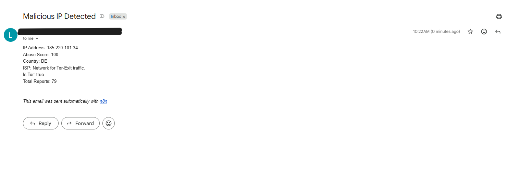

# Day 3 — n8n Install & IP Enrichment Workflow
**Date:** September 8, 2026
**Environment:** Ubuntu Server 24.04 VM | Windows Laptop (browser)

---

## Goals
- Install n8n on Ubuntu VM via Docker
- Build IP reputation lookup workflow using AbuseIPDB API
- Test with known malicious and clean IPs

---

## Journal
Installed n8n via Docker on the same Ubuntu VM running Wazuh. The initial npm install attempt got stuck for 15+ minutes, so I switched to Docker, which was faster and cleaner. First Docker run used `--rm` flag which deleted container data on stop, and I lost the first workflow build. Fixed by switching to a persistent volume command with `--restart unless-stopped` so n8n survives reboots and power outages automatically.

Built the first workflow as a form-based IP reputation checker. An analyst submits a suspicious IP through a web form; n8n automatically queries AbuseIPDB and returns full threat intelligence. Added an IF node to split results into malicious (score > 50) and clean paths, each sending a formatted email via Gmail SMTP.

Tested with two real IPs — 8.8.8.8 (Google DNS, clean) and 185.220.101.34 (known Tor exit node, malicious). Both are correctly routed to the right email path.

---

## Docker Command
```bash
sudo docker run -d --name n8n --restart unless-stopped \
  -p 5678:5678 \
  -e N8N_SECURE_COOKIE=false \
  -v n8n_data:/home/node/.n8n \
  docker.n8n.io/n8nio/n8n
```

---

## Workflow — IP Reputation Checker
**Nodes:** Form Trigger → HTTP Request (AbuseIPDB) → IF Node → Send Email

**AbuseIPDB node config:**
- Method: GET
- URL: `https://api.abuseipdb.com/api/v2/check`
- Query param: `ipAddress` → `{{ $json['IP Address'] }}`
- Header: `Key` → API key

**IF Node:** `abuseConfidenceScore` > 50 → malicious path, ≤ 50 → clean path

---

## Test Results

| IP | Score | ISP | Is Tor | Result |
|---|---|---|---|---|
| 8.8.8.8 | 0 | Google LLC | False | Clean email sent |
| 185.220.101.34 | 100 | Network for Tor-Exit traffic | True | Malicious alert sent |

---

## Issues Encountered

| Issue | Fix |
|---|---|
| npm install stuck 15+ minutes | Switched to Docker |
| Workflow lost on container stop | Added `-v n8n_data` volume and `--restart unless-stopped` |
| Gmail OAuth too complex for local n8n | Switched to Gmail SMTP credentials |
| Expression `$('On Form Submission').item.json['IP Address']` not found | Used `$json['IP Address']` instead |

---

## Screenshots


- n8n canvas showing the first two nodes in an unrun state — On form submission → HTTP Request (AbuseIPDB) — before testing.


- n8n canvas after a successful run — On form submission → HTTP Request (AbuseIPDB) — both nodes with green checkmarks and 1 item passed between them.


- AbuseIPDB HTTP Request node output for 8.8.8.8 returning abuseConfidenceScore 0, isWhitelisted true, ISP Google LLC, isTor false — confirmed clean IP.


- AbuseIPDB HTTP Request node output for 185.220.101.34 returning abuseConfidenceScore 100, isTor true, ISP "Network for Tor-Exit traffic," 78 total reports — confirmed malicious.


- n8n canvas showing the true (malicious) branch connected — On form submission → HTTP Request → IF → Send an Email.


- n8n canvas showing both branches wired — true branch routes to malicious alert, false branch routes to clean confirmation email.


- Gmail alert received for 185.220.101.34 — Abuse Score 100, ISP "Network for Tor-Exit traffic," Is Tor true, 79 total reports.

---

## Key Takeaways
- Always use a persistent Docker volume like `--rm` because it deletes everything on stop
- `--restart unless-stopped` handles power outages and unclean shutdowns automatically
- AbuseIPDB correctly identified a Tor exit node with score 100 vs Google DNS at score 0
- SMTP is simpler than OAuth for local self-hosted n8n
