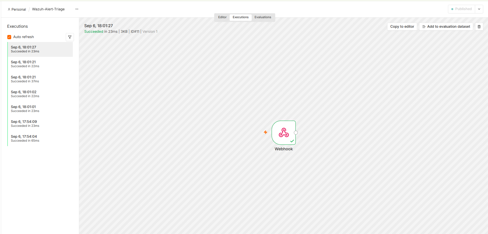
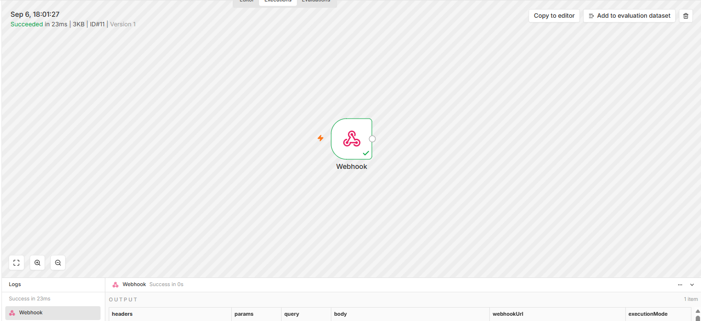

# Day 4 — Wazuh Webhook to n8n
**Date:** September 9, 2026
**Environment:** Ubuntu Server 24.04 VM | Windows Laptop

---

## Goals
- Configure Wazuh to send alerts to n8n via webhook
- Confirm real alerts flow into n8n automatically
- Validate alert data structure for IP extraction

---

## Journal
Configured Wazuh's ossec.conf to forward alerts to n8n via webhook. Two critical config issues hit back-to-back. The integration block was placed after the closing `</ossec_config>` tag which broke XML parsing and crashed the manager, and the integration name `custom-webhook` isn't recognized by Wazuh so it had to be changed to `shuffle` which is a supported name for custom webhooks.

Initial alert level threshold of 3 flooded n8n with hundreds of executions per minute. Raised to 7 to filter to meaningful security alerts only.

Confirmed the pipeline was working by stopping and starting the Wazuh agent on the Windows laptop — Wazuh detected the agent stop, generated an alert, and fired the webhook to n8n automatically. Multiple successful executions confirmed in n8n's Executions tab.

---

## Wazuh Integration Config
```xml
<integration>
  <name>shuffle</name>
  <hook_url>http://192.168.8.180:5678/webhook/wazuh-alerts</hook_url>
  <level>7</level>
  <alert_format>json</alert_format>
</integration>
```

Location: `/var/ossec/etc/ossec.conf` — must be placed inside the `</ossec_config>` closing tag

---

## Issues Encountered

| Issue | Fix |
|---|---|
| Wazuh manager crashed after config edit | Integration block placed after `</ossec_config>` — moved inside |
| n8n not receiving alerts | Integration name `custom-webhook` not recognized and changed to `shuffle` |
| n8n flooded with executions per minute | Alert level raised from 3 to 7 |
| Workflow using test URL not production | Published workflow — switches from `/webhook-test/` to `/webhook/` |

---

## Screenshots


- n8n Executions tab showing seven successful webhook executions from Sep 6 between 17:54 and 18:01, confirming Wazuh is sending alerts to n8n automatically.


- The single Webhook node ran in 23ms, showing a Wazuh "Agent stopped" alert (rule_id 506, agent Boognish) received successfully at the production webhook URL.

---

## Key Takeaways
- XML config errors crash Wazuh immediately, remember to always verify closing tag placement
- `shuffle` is required as the integration name for custom webhooks in Wazuh
- Alert level 7 filters noise while keeping meaningful security detections
- Webhook fires in under 1 second from Wazuh detection to n8n execution
