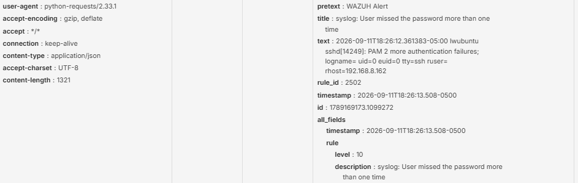
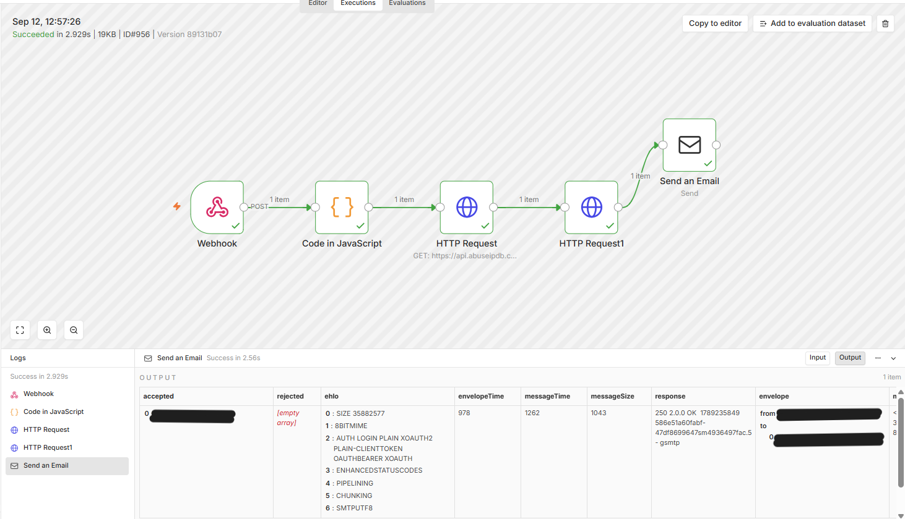
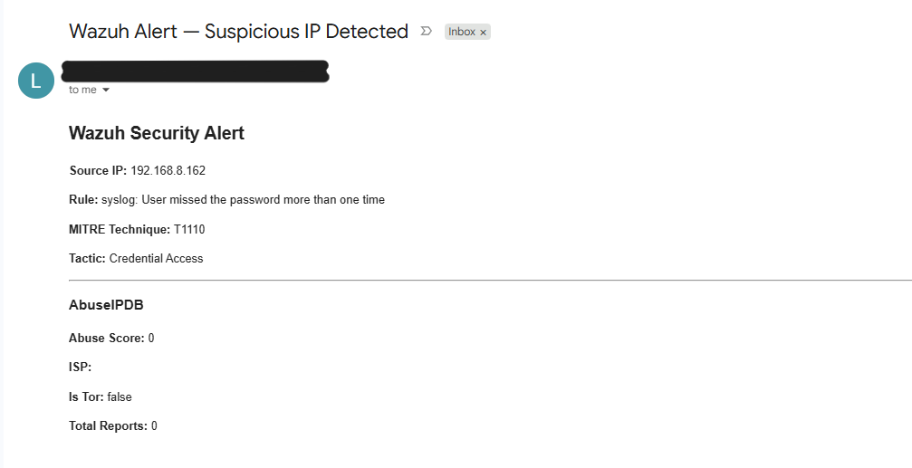

# Day 5 — Full Pipeline: IP Extraction, VirusTotal & Email Alert
**Date:** September 11, 2026
**Environment:** Ubuntu Server 24.04 VM | Windows Laptop | Separate laptop (attacker)

---

## Goals
- Add Code node to extract source IP from Wazuh alert text field
- Add VirusTotal API lookup node
- Add formatted email alert as final node
- Test full pipeline end to end with a real SSH brute force simulation

---

## Journal
Final day completing the full automated triage pipeline. Added a JavaScript Code node to extract the source IP from the Wazuh alert's `text` field using regex on the `rhost=` pattern. Initial code crashed on alerts without an IP — fixed by adding a null check that stops the workflow early for non-network alerts that don't contain a source IP.

Added VirusTotal HTTP Request node after AbuseIPDB using the free VirusTotal API. Added Send Email as the final node with an HTML formatted triage report pulling fields from the Webhook, Code, and AbuseIPDB nodes.

Tested end to end by running SSH failed logins from a separate laptop targeting the Ubuntu VM. Full pipeline ran in 2.9 seconds — Wazuh detected the brute force, webhook fired to n8n, IP extracted, AbuseIPDB queried, VirusTotal queried, triage email received with complete alert details.

---

## Final Workflow
```
Webhook → Code (IP Extract) → HTTP Request (AbuseIPDB) → HTTP Request (VirusTotal) → Send Email
```

---

## IP Extraction Code
```javascript
const text = $json.body.text || '';
const match = text.match(/rhost=(\d+\.\d+\.\d+\.\d+)/);
const srcip = match ? match[1] : null;

if (!srcip) {
  return [];
}

return [{ json: { srcip } }];
```

---

## End-to-End Test Result

| Field | Value |
|---|---|
| Source IP | 192.168.8.162 |
| Rule | syslog: User missed the password more than one time |
| MITRE Technique | T1110 |
| Tactic | Credential Access |
| AbuseIPDB Score | 0 (internal IP — expected) |
| Is Tor | False |
| Total Reports | 0 |
| Pipeline runtime | 2.9 seconds |

**Note:** AbuseIPDB score of 0 is expected — 192.168.8.162 is a private internal network IP. In production with external attacker IPs the score reflects real threat data as shown in Day 3 where 185.220.101.34 scored 100.

---

## Issues Encountered

| Issue | Fix |
|---|---|
| Code node crashed on alerts without source IP | Added null check — `return []` when no IP found stops workflow early |
| VirusTotal node "Referenced node doesn't exist" | Node named "Code in JavaScript" not "Code" — updated expression |

---

## Screenshots


- Incoming webhook request body showing the Wazuh alert for "syslog: User missed the password more than one time," rule_id 2502, rule level 10, and raw sshd PAM log text containing rhost=192.168.8.162 — the source IP the Code node extracts.
  

- n8n execution view of the full pipeline succeeding in 2.9s — Webhook → Code in JavaScript → HTTP Request (AbuseIPDB) → HTTP Request1 (VirusTotal) → Send an Email — all nodes green with SMTP 250 OK response confirmed.


- Gmail alert received showing Source IP 192.168.8.162, rule "syslog: User missed the password more than one time," MITRE technique T1110 (Credential Access), and AbuseIPDB enrichment data — full automated triage report delivered in under 3 seconds.

---

## Key Takeaways
- Always handle null cases in Code nodes — not every Wazuh alert contains a source IP
- Node names in n8n expressions must match exactly — "Code in JavaScript" vs "Code" breaks the workflow
- Full pipeline runs in under 3 seconds from Wazuh detection to email delivery
- Private internal IPs return score 0 from AbuseIPDB — this is correct behavior not a failure
