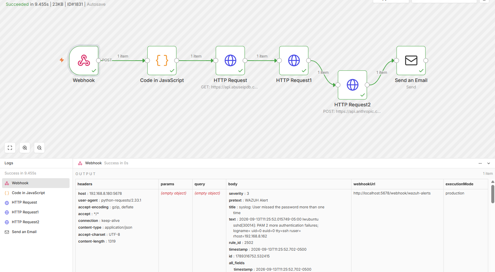
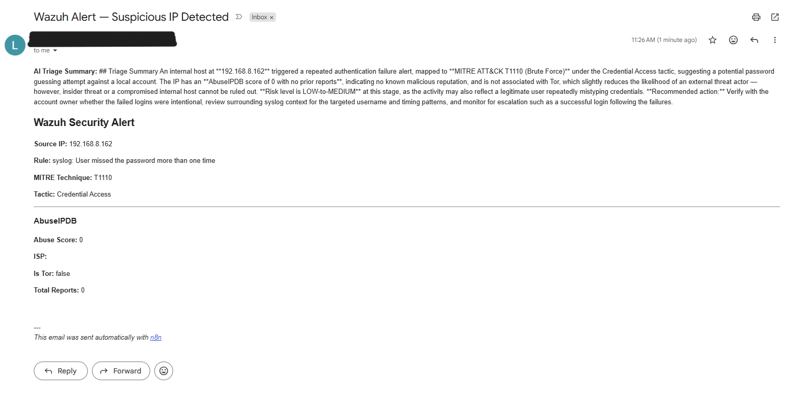

# Day 6 — AI Triage Summary with Claude API
**Date:** September 12, 2026
**Environment:** Ubuntu Server 24.04 VM | Windows Laptop

---

## Goals
- Add Claude AI node to the Wazuh alert triage pipeline
- Generate automated plain English triage summaries from raw alert data
- Test full pipeline end to end with AI summary included in email

---

## Journal
Final addition to the pipeline — an AI summarization node using the Anthropic Claude API. Added an HTTP Request node calling the Claude API between the VirusTotal lookup and the Send Email node. The node takes all enrichment data from AbuseIPDB, VirusTotal, and the Wazuh alert itself and prompts Claude to write a 3-4 sentence SOC analyst triage summary focused on risk level and recommended action.

Updated the email HTML body to include the AI summary at the top of the triage report so the analyst sees the plain English summary before the raw data.

Tested end to end with SSH brute force simulation from a separate laptop. Full pipeline fired — Wazuh detected, webhook triggered n8n, IP extracted, AbuseIPDB queried, VirusTotal queried, Claude generated a triage summary, email delivered with AI summary included.

---

## Final Workflow
```
Webhook → Code (IP Extract) → AbuseIPDB → VirusTotal → Claude AI Summary → Send Email
```

---

## Claude API Node Config
- **Method:** POST
- **URL:** `https://api.anthropic.com/v1/messages`
- **Headers:**
  - `x-api-key` → Anthropic API key
  - `anthropic-version` → `2023-06-01`
  - `content-type` → `application/json`
- **Model:** `claude-sonnet-4-6`
- **Max tokens:** 1024

**Prompt:**
```
You are a SOC analyst. Write a 3-4 sentence triage summary for this security alert. 
Be concise and focus on risk level and recommended action.
Alert data: IP, Rule, MITRE technique, Tactic, AbuseIPDB Score, ISP, Is Tor, Total Reports
```

**AI summary field in email:**
```html
<p><b>AI Triage Summary:</b> {{ $json.content[0].text }}</p>
```

---

## Issues Encountered

| Issue | Fix |
|---|---|
| AI node connected as branch instead of inline | Disconnected VirusTotal → Email, rewired as VirusTotal → AI → Email |
| `anthropic-version` header required | Must pass `2023-06-01` on every request — Anthropic API requirement |

---

## Screenshots


- Full workflow canvas showing all 6 nodes in sequence


- Email received with AI triage summary at top

---

## Key Takeaways
- Claude API requires `anthropic-version` header on every request
- AI summary node must be placed inline between enrichment and email — not as a branch
- AI-generated triage report converts raw JSON threat data into actionable analyst language automatically
- Full pipeline now runs end to end in under 3 seconds with zero manual analyst input
